# Manual de Uso — Plataforma de Afiliados + IA

Este manual é gerado a partir do teste E2E (`apps/web/e2e/full-walkthrough.spec.js`)
— as capturas de tela abaixo **não são feitas à mão**. Se a interface mudar, rode
`npm run e2e --workspace=apps/web` de novo e as imagens são substituídas
automaticamente, na mesma pasta (`docs/manual-screenshots/`). Isso significa que
este manual nunca fica desatualizado por esquecimento — ele fica desatualizado só
se ninguém rodar o teste depois de mudar a UI, o que é bem mais fácil de notar
(a imagem antiga ainda existe, só não bate mais com a tela real).

---

## 1. Login

Ao abrir o sistema pela primeira vez (sem nenhum usuário cadastrado ainda), a tela
pede pra você criar a conta de administrador. Depois disso, é login normal com
e-mail e senha.

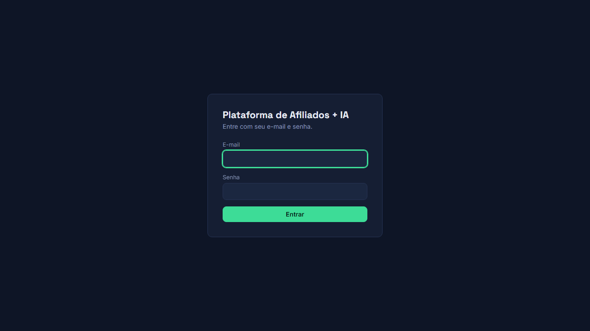

---

## 2. Dashboard — Visão Geral

A primeira tela depois do login. Mostra um resumo rápido de tudo: quantos produtos
você tem cadastrados, quantos são viáveis financeiramente, quantos rascunhos de
campanha existem, quantos concorrentes você mapeou, e se tem algum alerta aberto
que precisa da sua atenção. Cada número é clicável — leva direto pra tela
correspondente.

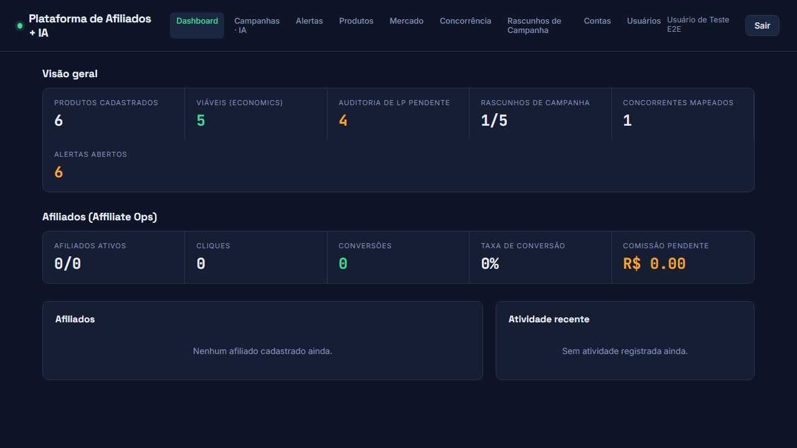

---

## 3. Cadastrar um produto

A aba **Produtos** é onde tudo começa. Clique em **"+ Adicionar produto"** pra
abrir o formulário rápido.

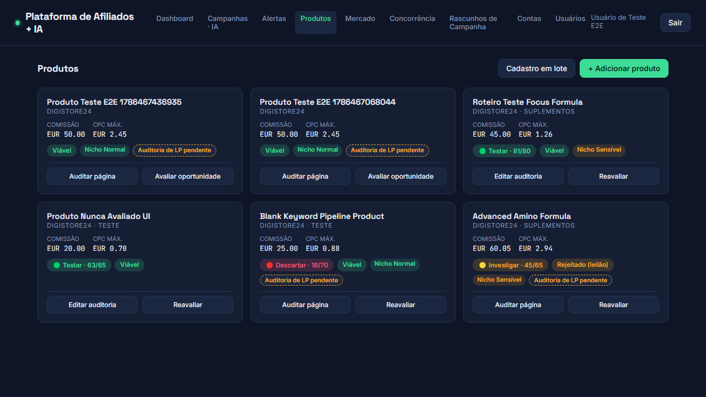
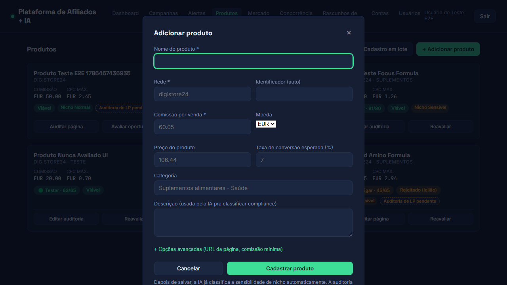

Preencha nome, rede, comissão e taxa de conversão esperada. Enquanto você digita,
o sistema já calcula ao vivo se o produto é financeiramente viável — mostra o CPC
máximo que você pode pagar e se o cálculo aprova ou reprova, **antes** de você
salvar qualquer coisa.

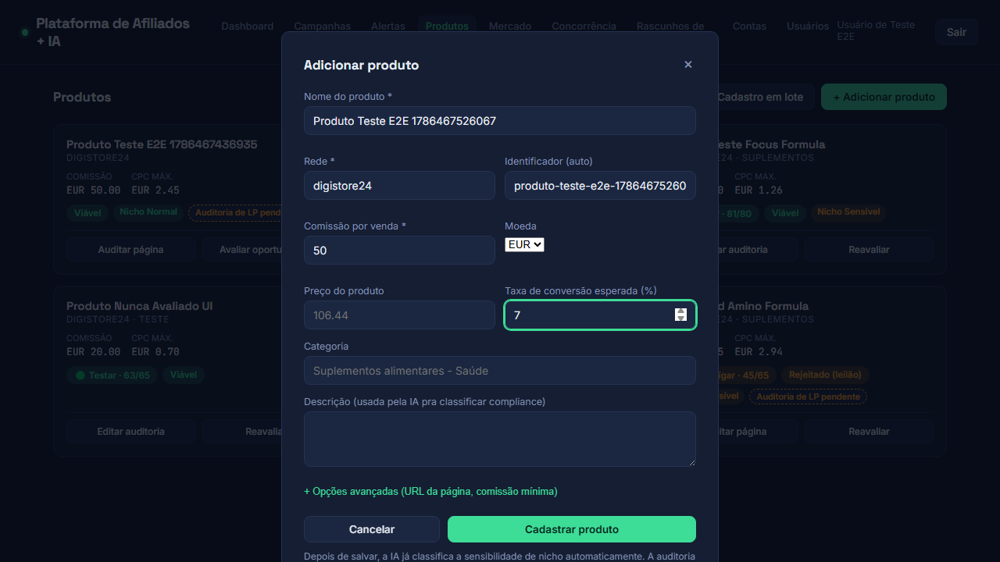

Depois de salvar, o produto aparece na lista, e a IA já roda uma classificação de
compliance automática (se o nicho é sensível, se precisa de presell) em segundo
plano.

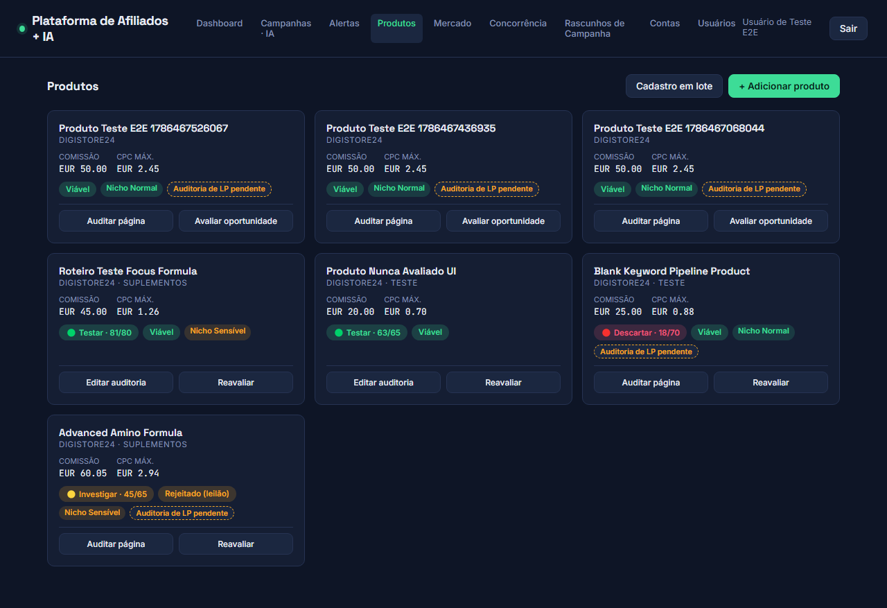

**Dica**: a URL da página de vendas e a auditoria de LP (CTA, VSL, se o parâmetro
de afiliado sobrevive até o checkout) não precisam ser preenchidas nesse momento —
você pode voltar depois, quando realmente abrir a página de vendas, e completar
pelo botão "Auditar página" no card do produto.

---

## 4. Análise de mercado — "vale a pena anunciar?"

Na aba **Mercado**, clique num produto pra ver (ou rodar) a análise completa.

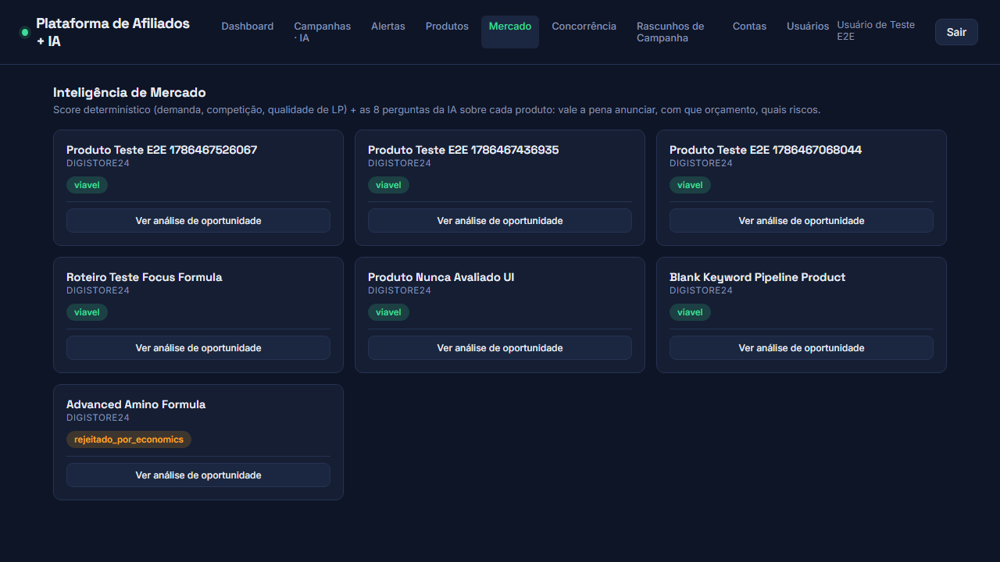

O modal mostra um score determinístico (demanda, competição, qualidade da página
de vendas) e, ao clicar em "Analisar oportunidade", a IA responde as perguntas que
importam: vale a pena anunciar, qual o CPC/CPA máximo, orçamento inicial sugerido,
principais riscos, e sugestões pra melhorar o retorno.

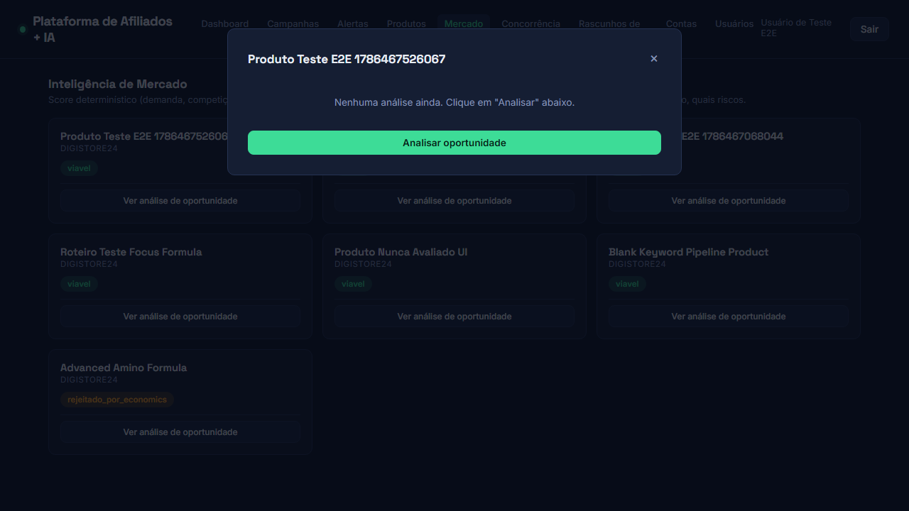
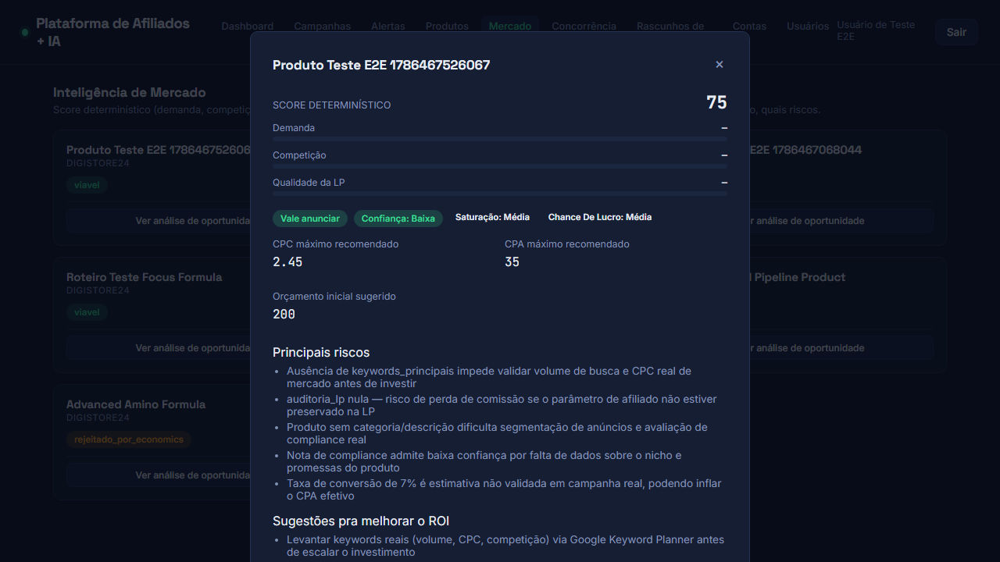

---

## 5. Rascunho de campanha

Na aba **Rascunhos de Campanha**, o sistema prepara tudo que você precisa pra
criar a campanha manualmente no Google Ads — mas **não cria nada sozinho** no
Google Ads. Você revisa e cria com as próprias mãos.

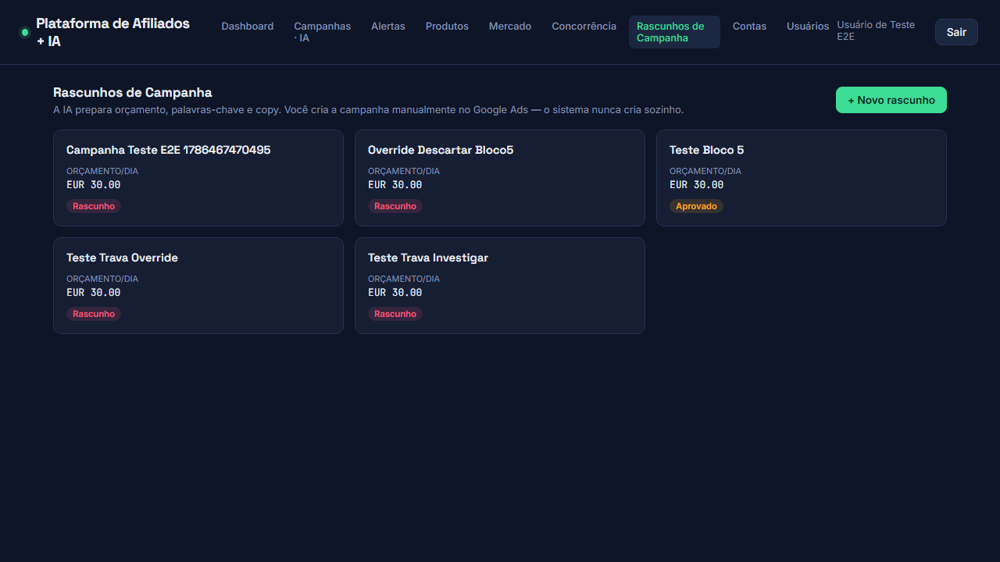

Escolha o produto, dê um nome pra campanha e defina o orçamento diário (existe um
teto configurado que o sistema nunca deixa passar). A IA já sugere palavras-chave
de fundo de funil e a copy do anúncio (headlines e descrições), checando se bate
com o que a página de vendas realmente entrega.

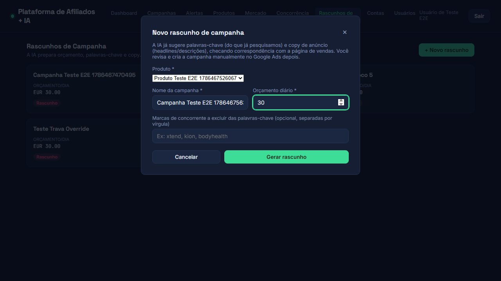

Depois de gerado, você pode copiar o texto formatado (pronto pra colar no Google
Ads) com um clique.

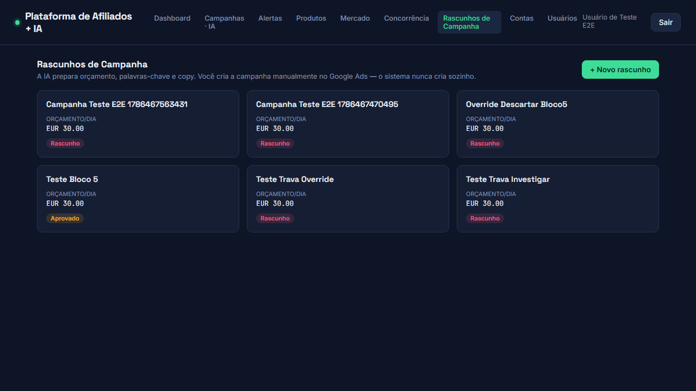

---

## 6. Concorrência

A aba **Concorrência** guarda o que você encontrou pesquisando manualmente no
[Google Ads Transparency Center](https://adstransparency.google.com) — anúncios
reais de concorrentes, com histórico de mudança ao longo do tempo.

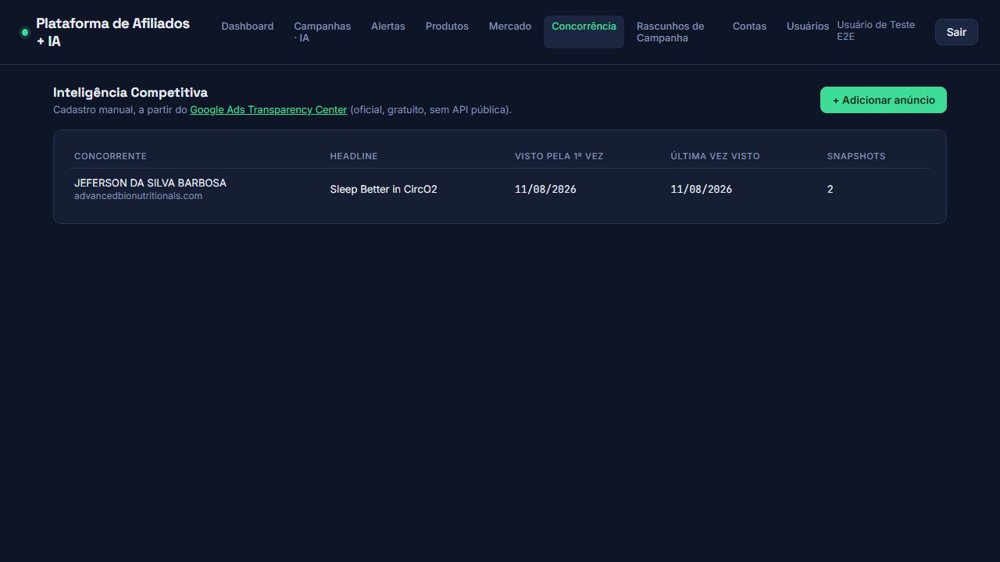

---

## 7. Contas e Governança

A aba **Contas** mostra a estrutura guarda-chuva — MCC, operações e contas
individuais — com indicador de saúde (🟢 saudável, 🟡 atenção, 🔴 crítico) calculado
automaticamente. Três formas de ver a mesma informação:

**Árvore** — hierarquia expansível, boa pra navegar por operação/MCC.

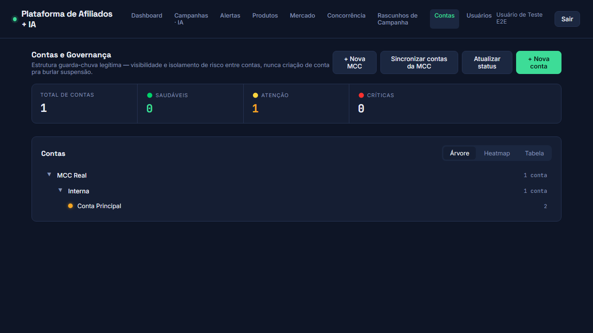

**Heatmap** — grade de cores, boa pra identificar problema em poucos segundos.

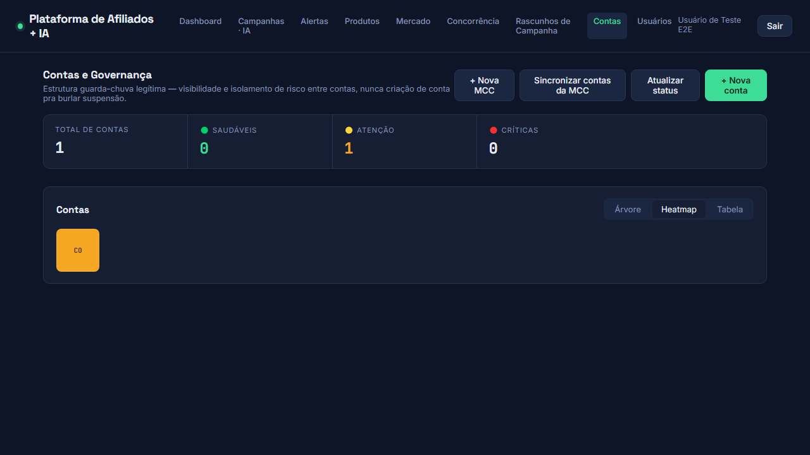

**Tabela** — visão detalhada, linha por linha.

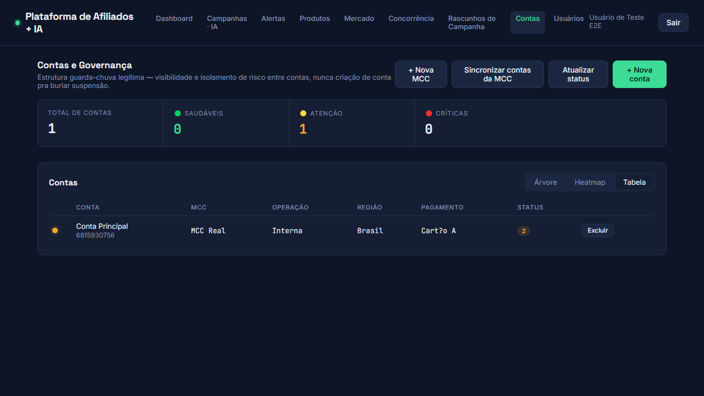

O botão "Sincronizar contas da MCC" busca a hierarquia real direto do Google Ads —
não precisa cadastrar conta por conta na mão.

---

## 8. Alertas

A aba **Alertas** centraliza tudo que o sistema detectou sozinho: campanha
pausada, queda de impressão, anúncio reprovado, mudança de status de conta. Isso
roda em segundo plano (a cada 15 minutos, se o monitoramento automático estiver
ligado) — você não precisa ficar checando cada tela manualmente.

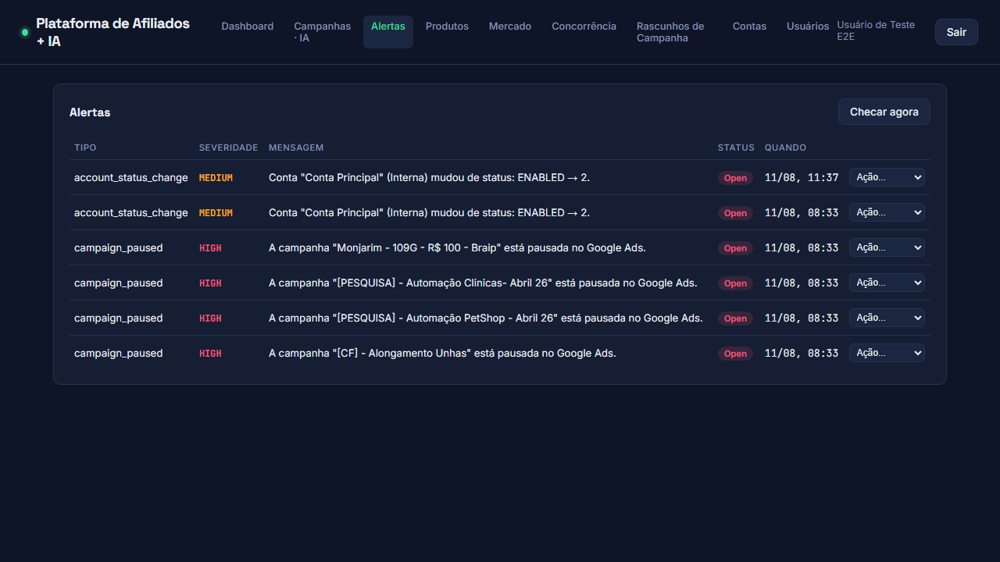

---

## Como manter este manual atualizado

```bash
cd apps/web
npm run e2e
```

Isso roda o teste completo (precisa da API e do frontend já rodando) e regenera
todas as imagens acima. Se alguma tela mudou de verdade, o teste também pode
quebrar (ele verifica texto real, não só tira foto) — isso é bom, é o mesmo teste
avisando que o manual estava prestes a ficar desatualizado.
